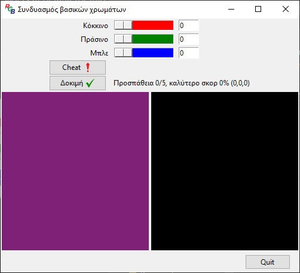
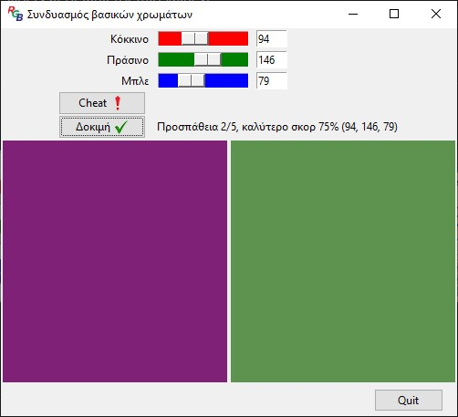
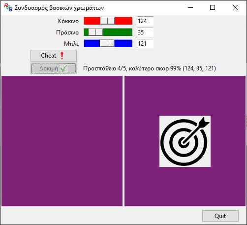

# Hue Hunter

Hue Hunter is a small interactive game built with Python and Tkinter, where the player tries to match a randomly generated color using RGB sliders.

The idea is simple: a target color is shown on the left, and the player adjusts red, green, and blue values to recreate it as closely as possible. The closer the match, the higher the score.

---

## How the game works

Each round, a random color is generated.

You can adjust three sliders (Red, Green, Blue) and see your color update in real time.
After each attempt, the game calculates how close your guess is to the target color.

You have up to 5 attempts to reach a score of at least 90%.

* If you succeed → you win
* If not → game over

---

## Quick Start

```bash
python main.py
```

---

## Features

* Simple and intuitive GUI using Tkinter
* Real-time color preview
* Score calculation based on RGB similarity
* Attempt tracking and best score display
* Visual feedback for win and loss conditions

---

## Technologies used

* Python
* Tkinter (standard GUI library)

---

## How to run

Make sure you have Python installed.

Then run:

```
python main.py
```

---

## Project Structure

.
├── main.py
├── utils.py
├── screenshots/
│   ├── start.jpg
│   ├── gameplay.jpg
│   └── result.jpg
├── cheat.png
├── matchy.png
├── gameover.png
├── tick.png
└── RGB.ico

---

## Notes

This project was developed as part of a Python course assignment focused on GUI development and event-driven programming.

---

## Future improvements (ideas)

* Add a restart button
* Improve UI styling

---

## Preview

### Game Start


### Gameplay


### Result

